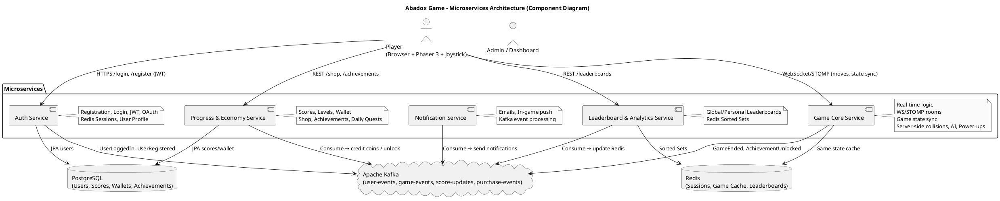

# Abadox NES Remake - Microservices + Phaser 3

A modern remake / enhanced clone of the classic NES horizontal shoot 'em up **Abadox** (1989), featuring bio-organic gore visuals, persistent power-ups, virtual economy, real-time leaderboards, and optional co-op mode.

This is a **senior full-stack portfolio project** showcasing:
- Event-driven microservices with Spring Boot + Kafka
- Performant browser game frontend with Phaser 3 + full Gamepad/Joystick support
- Real-time synchronization via WebSockets/STOMP
- Secure persistence with PostgreSQL, Redis caching, and JWT authentication

**Inspired by:** Abadox (NES), Life Force, R-Type  
**Goal:** Playable locally with joystick, demo-ready for interviews, scalable to production.

## 🚀 Demo / Screenshots

(Add GIFs/screenshots here once ready – placeholders for now)

  
  


## 🛠️ Tech Stack

### Frontend (Phaser 3)
- **Game Engine:** Phaser 3 (latest stable)
- **Language:** JavaScript ES6+ / TypeScript (recommended for scale)
- **Build Tool:** Vite
- **Physics:** Arcade Physics
- **Input:** Keyboard + HTML5 Gamepad API (full joystick support)
- **Optimization:** Object Pooling, Texture Atlases

### Backend (Spring Boot Microservices)
1. **Auth Service** → Registration, login, JWT issuance, OAuth2 (Google), user profiles
2. **Game Core Service** → Real-time game logic, WebSocket/STOMP rooms, server-side collisions, enemy AI, power-up application
3. **Progress & Economy Service** → Scores, levels, wallet (coins), shop, achievements, daily quests
4. **Leaderboard & Analytics Service** → Global/personal leaderboards, stats (Redis Sorted Sets)
5. **Notification Service** → Emails ("New highscore!"), in-game push (Kafka consumers)

### Infrastructure
- **Messaging:** Apache Kafka (topics: user-events, game-events, score-updates, purchase-events)
- **Storage:** PostgreSQL (persistent data), Redis (sessions, game state cache, leaderboards)
- **Real-time:** WebSockets + STOMP protocol
- **Security:** Spring Security + JWT
- **Dev Orchestration:** Docker Compose

## 📂 Project Structure (Summary)

```
abadox-remake/
├── frontend/                     # Phaser 3 game
│   ├── src/
│   │   ├── scenes/               # Boot, Preloader, Game, GameOver…
│   │   ├── objects/              # Player, Enemy, Bullet, Boss…
│   │   ├── managers/             # Score, Audio, Input
│   │   ├── assets/               # Sprites, audio, atlases
│   │   └── main.js
│   ├── vite.config.js
│   └── package.json
├── backend/                      # Spring Boot microservices
│   ├── auth-service/
│   ├── game-core-service/
│   ├── progress-economy-service/
│   ├── leaderboard-service/
│   └── notification-service/
├── docs/                         # Diagrams, references
│   └── architecture.puml         # Component diagram (PlantUML)
├── docker-compose.yml            # Kafka, Zookeeper, Postgres, Redis
└── README.md                     # This file
```

## 🏗️ Architecture

Component diagram (microservices + frontend + event flow):



Render it live at: https://editor.plantuml.com/ (paste the code from `docs/architecture.puml`)

## ⚡ Quick Start (Local Development)

### Prerequisites
- Node.js 18+
- Java 17+ (Spring Boot)
- Docker & Docker Compose

### 1. Frontend
```bash
cd frontend
npm install
npm run dev
```
→ http://localhost:5173 (Vite default)

### 2. Infrastructure + Backend
```bash
# Start infra (Postgres, Redis, Kafka)
docker-compose up -d

# Run each microservice in separate terminals
cd backend/auth-service && ./mvnw spring-boot:run
cd backend/game-core-service && ./mvnw spring-boot:run
# ... repeat for others
```

### 3. Connect Frontend to Backend
Update `frontend/src/config.js`:
```js
export const API_BASE = 'http://localhost:8080';      // Adjust per service
export const WS_URL   = 'ws://localhost:8081/ws-game'; // Game Core WS
```

## 🎮 Controls
- **Keyboard:** WASD / Arrows → move, SPACE → shoot
- **Gamepad/Joystick:** Left stick → move, A/X button → shoot (full HTML5 Gamepad API support)

## 📈 Roadmap
- [x] Core gameplay (scroll, shooting, enemies, collisions)
- [x] Joystick/Gamepad support
- [ ] Persistent power-ups & upgrades
- [ ] Coin economy + in-game shop
- [ ] Real-time leaderboards (Redis)
- [ ] 2-player co-op mode
- [ ] Multi-stage bosses (State pattern)
- [ ] JWT auth + player profiles
- [ ] Email notifications (Kafka)

## 📜 Development Rules (Frontend)
All frontend standards are in `RULES-FRONTEND-Phaser3/`:
- `AGENT_RULES.md` → AI agent behavior
- `ARCHITECTURE.md` → Phaser 3 structure & standards
- `FUNCTIONAL_SPEC.md` → Core mechanics
- `TEMPLATE_HU.md` → Frontend User Story template

## ✒️ Author
**Pablo** – Full-Stack Developer / Game Dev  
Don Torcuato, Buenos Aires – 2026  
Personal portfolio project – open to feedback & contributions!

MIT License – feel free to fork & play!
